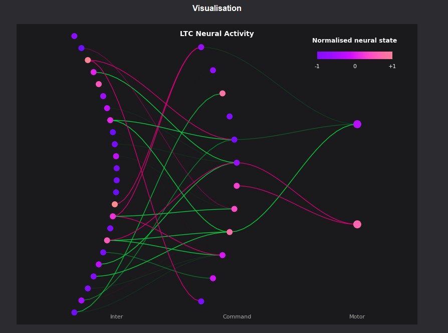
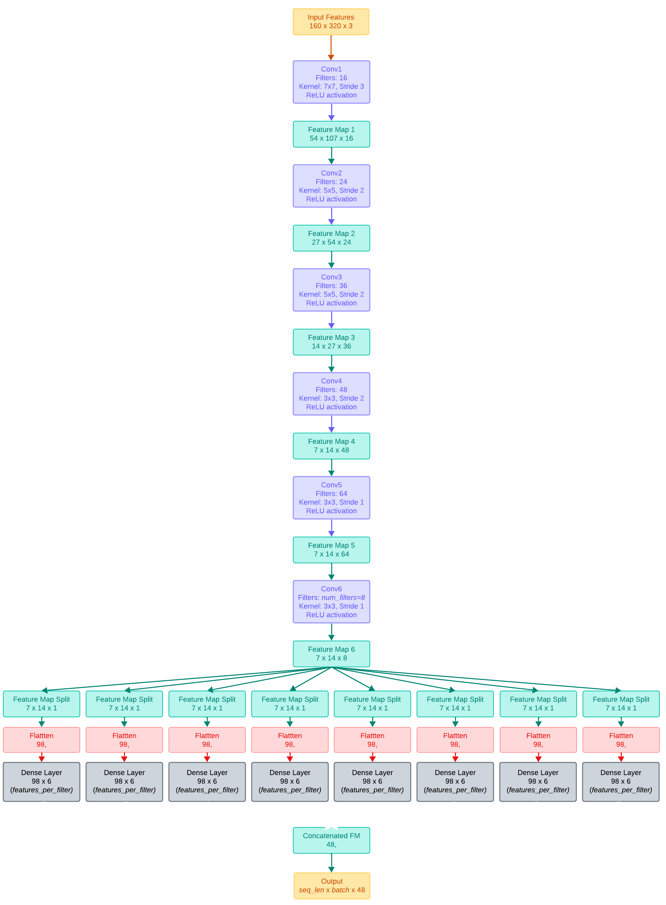
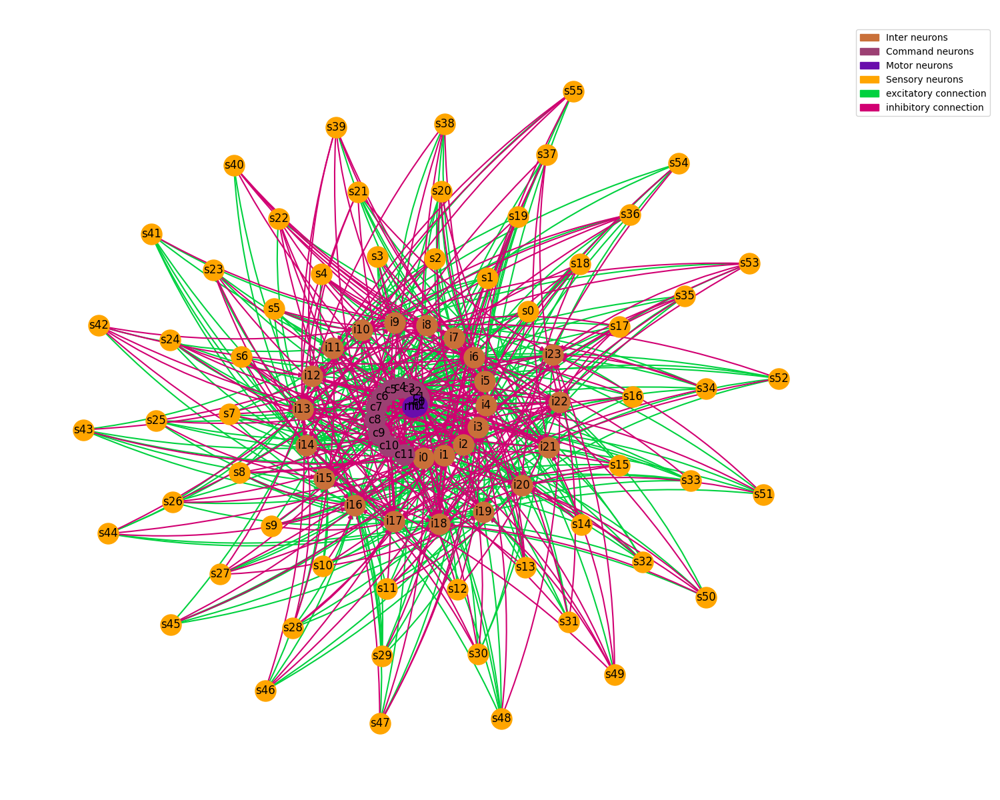

## Updates
* `gui_v3` now has real-time model visualisation

* speed calculations/visualisations are now toggleable to prevent over-head calculations during live inference and initial set up of the GUI

# 🚗 Project Overview
This project implements a **Level 2 autonomous driving system** using a novel hybrid architecture combining CNNs with Liquid Time-Constant (LTC) cells for highway driving assistance. Our lightweight model processes video frames and vehicle telemetry to predict steering angles and acceleration in real-time. 

- 📄 [ Full Technical Report](https://docs.google.com/document/d/1mZLEZwRek-2oWJMrC03CmJ7OBZdEgZl2rhWGWmrzpeE/edit?usp=sharing) - Contains detailed architecture diagrams, experimental results, and comprehensive analysis.

# 📊 Dataset
## Comma.ai Dataset

- **Download**:  https://archive.org/details/comma-dataset
- **GitHub**: https://github.com/commaai/research/tree/master
- **Size**: ~75GB video data (11 driving videos)
- **Format**: H5 files containing video frames and telemetry
- **Features**:
     - **Input**: *Video frames (160×320×3)* + *speed_abs*;
    - **Targets**: *steering_angle*, *car_accel*

# 🧠 Model Architecture
Our model explores the implementation of LTC Networks [1,2], specifically the WormNet Architecture which was the original [Convolution + LTC cell hybrid](https://github.com/mlech26l/keras-ncp) framework for autonomous steering *[See Video here](https://youtu.be/IlliqYiRhMU?=I1ow4FDprk-BhDM2)*. Our implementation provides the pytorch version for steering and acceleration, with modifications to the architecture for our current dataset; We may potentiallly scale the autonomy level in the future. The full architecture contains:

- **Convolutional Head**: 6-layer CNN for visual feature extraction (48 feature output)
- **Speed Embedding**: 8-dimensional speed feature representation
- **LTC Cell**: 98 neurons (56 sensory, 24 inter, 12 command, 2 motor)

## Architecture Diagrams
### Convolution Head

---
---
### LTC Cell (using NCP wiring)

*Note: Not all diagrams included- You can view them in the report*

# 🚀 Quickstart

git clone https://github.com/Prajakta371/AutonomousDriving-LTC.git
cd AutonomousDriving-LTC
conda create -n autodrive python=3.9
conda activate autodrive
pip install -r requirements.txt
python gui_v3/main.py   # run the real-time GUI

🎯 My Role

This project was developed as part of UTS AI TechFest 2025.
My contributions included:

Implemented the PyTorch CNN + LTC pipeline for steering & acceleration prediction

Designed and built the real-time GUI (gui_v3) with live model visualisation

Conducted training experiments on the Comma.ai dataset

Integrated speed/accel simulation visualisations

Documented results and model evaluation

---
## 👥 Team Credits
This project was developed with:
- Adrian Kumar  
- Yan Liang  
(see report for full details)
---
# References:

- [1] Hasani et al. (2020) - [Liquid Time-constant Networks](https://arxiv.org/pdf/2006.04439)
- [2] Official LTC Implementation - [GitHub](https://github.com/mlech26l/ncps)

*See full reference list in report*

- Please view [`code-explanation.md`](Code-explanation.md) to get started and to understand the current limitations that need to be addressed in the future
- Create a virtual environment with python version 3.9 (anaconda recommended), then install `requirements.txt` via `pip install -r requirements.txt`
- Project Showcase: Watch our project in action! [Video](https://www.youtube.com/watch?v=FuSemjOSa5k) by Yan Liang.
